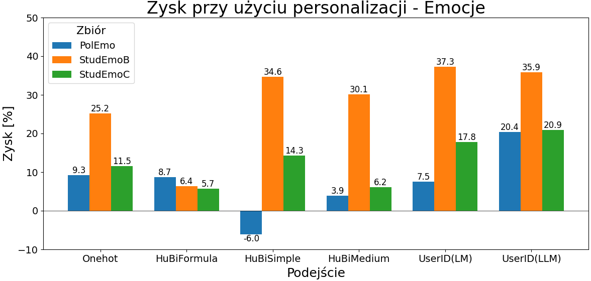
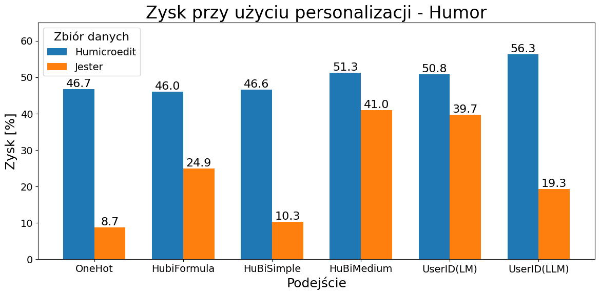
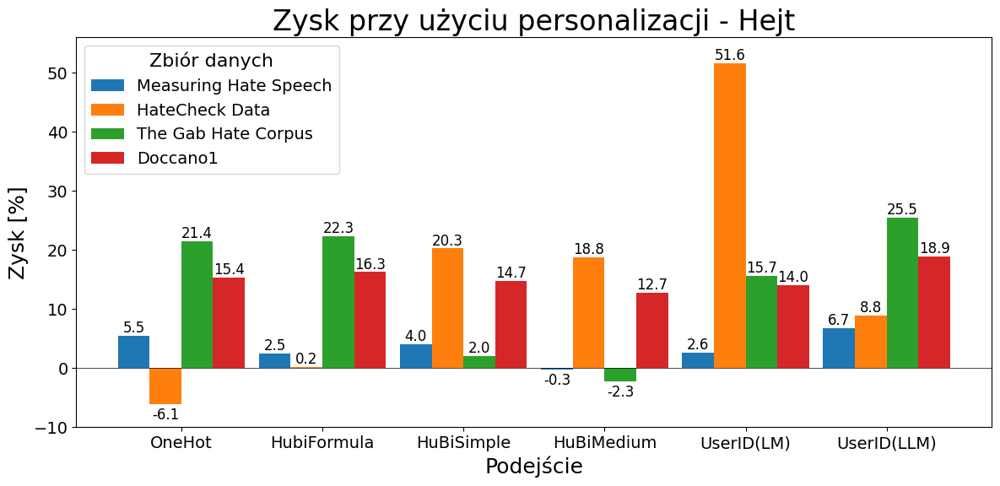
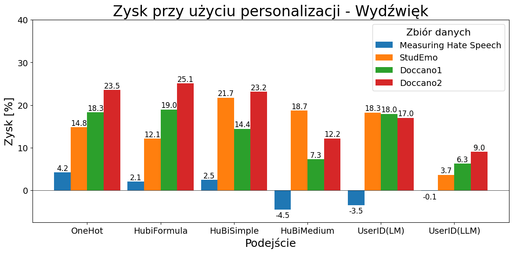

# Nasze Eksperymenty

Witaj na stronie przedstawiającej nasze najnowsze eksperymenty w dziedzinie sztucznej inteligencji. Poniżej znajdziesz szczegółowy opis każdego z projektów, nad którymi pracowaliśmy.

## Zespół

Nasz zespół składa się z doświadczonych programistów i naukowców zajmujących się AI, którzy mają na celu rozwijanie nowatorskich rozwiązań w dziedzinie przetwarzania języka naturalnego i uczenia maszynowego.

- **Michał Madej** 
- **Dawid Jędrzejewski** 
- **Katarzyna Broczkowska**
- **Mikołaj Libura**
- **dr inż. Jan Kocoń** - Opiekun Pracy
- **prof. dr hab. inż. Przemysław Kazienko** - Opiekun Pracy

## Projekty

### Eksperyment 1: Generowanie rymów przez LLM'y 

**Cel:** 

**Opis:** 

**Wyniki:**

### Eksperyment 2: Personalizacja w zadaniu klasyfikacji

**Cel:** 

**Opis:** 

**Wyniki:** 

**Więcej informacji:**

## Kontakt

Jeśli masz pytania dotyczące naszych projektów, prosimy o kontakt:

- Email: [kontakt@naszazespół.com](mailto:kontakt@naszazespół.com)
