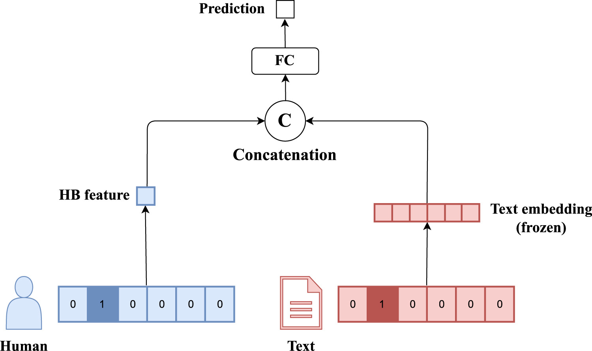

# Nasze Eksperymenty

Witaj na stronie przedstawiającej nasze najnowsze eksperymenty w dziedzinie sztucznej inteligencji. Poniżej znajdziesz szczegółowy opis każdego z projektów, nad którymi pracowaliśmy.

## Zespół

Nasz zespół składa się z doświadczonych programistów i naukowców zajmujących się AI, którzy mają na celu rozwijanie nowatorskich rozwiązań w dziedzinie przetwarzania języka naturalnego i uczenia maszynowego.

- **Michał Madej** 
- **Dawid Jędrzejewski** 
- **Katarzyna Broczkowska**
- **Mikołaj Libura**
- **dr inż. Jan Kocoń** - Opiekun Pracy
- **prof. dr hab. inż. Przemysław Kazienko** - Opiekun Pracy

## Projekty

### Eksperyment 1: Generowanie rymów przez LLM'y 

**Cel:** Celem eksperymentu było sporządzenie metodologii pozwalającej na takie spreparowanie wybranego modelu, aby był on w stanie generować treść poetycką w języku polskim, na przykład wiersz. W rozszerzonej wersji model miał być w stanie także przyjąć dokładną instrukcję co do formatu rymów (na przykład ABAB lub ABBA) oraz długości tekstu.

**Opis:** W trakcie analizowania możliwości generowania treści w języku polskim przez poszczególne modele zauważyliśmy, że nie są one w stanie stworzyć prostego, rymującego się tekstu, który byłby spójnie merytorycznie i tworzyłby logiczną całość. Zaczęliśmy zgłębiać ten temat i zauważyliśmy, że nie są one nawet w stanie podawać kilku poprawnych par słów rymujących się w języku polskim. Najpopularniejszy w tamtym czasie model GPT3 po wysłaniu mu zapytania o wskazanie dziesięciu przykładów podawał zazwyczaj maksymalnie dwie lub trzy poprawne pary. Sprawdziliśmy też teorię czy niepoprawne pary słów są tłumaczeniami z języka angielskiego na język polski i czy może rymują się w swojej oryginalnej formie, ale tutaj także były niepoprawne.

**Wyniki:**

### Eksperyment 2: Personalizacja w zadaniu klasyfikacji

W tym eksperymencie zbadany został wpływ różnych metod personalizacji na osiągany przez modele klasyfikacji. Zbadane zostalo podejście UserID oraz architektury opartę o miarę Human Bias. Porównane dodatkowo zostały wielkie model językowe (LLM) posiadające miliardy parametrów ze "zwykłymi" modelami językowymi.

**Opis:** 
#### UserID z głową klasyfikacyjną

#### UserID z głową generatywną

Przedstawione schematy architektur HuBi pochodzą z artykułu naukowego [Kazienko, 2023](https://doi.org/10.1016/j.inffus.2023.01.010)
Baseline jest modelem służącym jedynie jako niepersonalizowane odniesienie, dzięki któremu możliwa jest wizualizacja przyrostu.

OneHot — model ten jest niezwykle podobny do omawianego wcześniej podejścia z użyciem
User ID. W tym przypadku wartość User ID jest dodawana w postaci wektora kodowanego w sposób one-hot do wektora osadzeń pochodzącego z modelu językowego.

HuBi-Formula - architektura opierająca się na wyliczonej wcześniej wartości Human Bias.
Struktura tego modelu jest identyczna do modelu OneHot, różniąca się obecnością wspomnianej
miary HB zamiast wartości User ID. 

HuBi-Simple - jest już pełnym modelem predykcyjnym, bazowanym na idei zaczerpniętej
z dziedziny systemów rekomendacyjnych. Do uzyskania predykowanej etykiety model wykorzystuje trzy różne komponenty, są nimi wspomniane wcześniej zamrożone osadzenia z modelu
językowego, wyuczalna wartość HB oraz wartość Word-Bias. Zmianą w porównaniu do wcześniejszych modeli jest zdolność miary HB do nauki podczas etapu treningu. Nie jest ona już
prekalkulowana przed głównym treningiem modelu

HuBi-Medium to model również inspirowany metodami systemów rekomendacyjnych, a dokładnie metodą Neural Collaborative Filtering. W porównaniu do modelu HuBi-Simple
tworzy on wielowymiarowy wektor osadzeń zawierający informacje o użytkowniku. Dodatkowo
jego długość jest hiperparametrem, co pozwala na dostosowanie go do swoich potrzeb.

**Wyniki:** 

**Ogólne wnioski:**
W zależności od rodzaju wykonywanej klasyfikacji oraz wykorzystywanego zbioru danych, poszczególne metody diametralnie różniły się oferowanym zyskiem wydajności. Biorąc pod uwagę zysk ze wszystkich zbiorów danych w obrębie danego zadania klasyfikacji, dla humoru najlepszymi metodami były HuBiMedium i UserID(LM), dla wydźwięku były to Onehot, HuBiFormula oraz HuBiSimple, dla emocji był to przede wszystkim UserID(LLM), a dla Hejtu UserID(LM).
